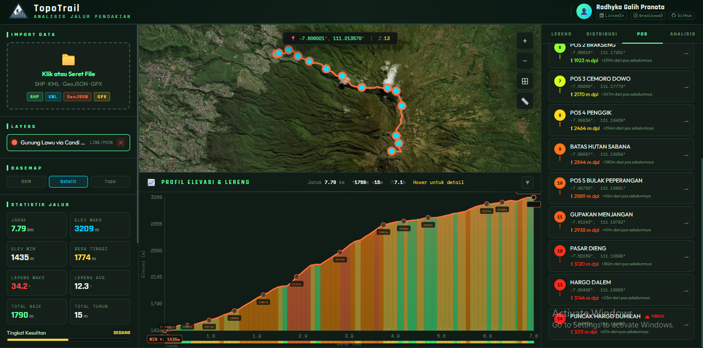

# 🏔 TopoTrail — WebGIS Analisis Jalur Pendakian

Aplikasi WebGIS berbasis browser untuk menganalisis jalur pendakian gunung
secara interaktif, dilengkapi profil elevasi, analisis lereng, dan
rekomendasi berbasis jurnal ilmiah.

---

## 📁 Struktur File

```
topotrail/
│
├── index.html          ← Halaman utama (HTML + link semua file)
│
├── css/
│   └── style.css       ← Seluruh gaya tampilan (tema dark, layout, komponen)
│
└── js/
    ├── config.js       ← Konstanta warna, data demo Lawu & Sumbing
    ├── utils.js        ← Toast notifikasi, loading overlay, alat ukur jarak
    ├── map.js          ← Inisialisasi peta Leaflet, basemap, koordinat kursor
    ├── parsers.js      ← Konversi KML & GPX ke GeoJSON
    ├── analysis.js     ← Komputasi inti: haversine, lereng, elevasi, difficulty
    ├── charts.js       ← Grafik Chart.js (histogram, pie, gain/loss)
    ├── profile.js      ← Canvas profil elevasi interaktif (hover, klik, zoom)
    ├── panels.js       ← Panel kanan: tab lereng, waypoint, analisis ilmiah
    └── layers.js       ← Manajemen layer: upload, tambah, hapus, pilih
```

---

## 🔗 Urutan Load JavaScript

Urutan `<script>` di `index.html` penting karena ada ketergantungan antar file:

```
config.js   → mendefinisikan COLORS, DEMOS
utils.js    → notify, showLoad, measuring
map.js      → membuat `map` (dipakai oleh layers, profile, panels)
parsers.js  → kml2gj, gpx2gj (dipakai oleh layers)
analysis.js → compute, slopeClass, dll (dipakai oleh profile, panels, layers)
charts.js   → drawCharts (dipakai oleh analysis/layers)
profile.js  → drawProfile, renderCanvas (dipakai oleh analysis)
panels.js   → drawSlopeTab, updateWaypointPanel, buildAnalysisPanel
layers.js   → addLayer, processFile (memanggil semua yang di atas)
```

---

## 🧪 Format File yang Didukung

| Format   | Keterangan                    |
|----------|-------------------------------|
| GeoJSON  | Format standar GIS berbasis JSON |
| KML      | Format Google Earth/Maps      |
| GPX      | Format GPS (track + waypoint) |
| SHP/ZIP  | Shapefile ESRI (perlu di-ZIP) |

---

## 🌐 Live Demo

| Link Akses | Status |
| :--- | :--- |
| [**Buka Aplikasi TopoTrail**](https://radika27.github.io/TopoTrail/) |  |

> [!TIP]
> **Cara Cepat:** Setelah masuk ke website, klik tombol **"Gunung Lawu"** di panel kiri untuk melihat simulasi analisis jalur secara otomatis.

---
## 📖 Panduan Penggunaan Detail

Aplikasi ini dirancang untuk memberikan analisis mendalam terhadap jalur pendakian. Berikut adalah langkah-langkah penggunaannya:


1. Menggunakan Data Demo
Jika kamu baru pertama kali mencoba dan tidak memiliki file koordinat, gunakan fitur Demo:
Klik tombol "Gunung Lawu" atau "Gunung Sumbing" pada panel kiri.
Peta akan otomatis melakukan zoom ke lokasi dan menampilkan profil elevasi lengkap dengan statistik kelerengan.

2. Input Data Mandiri (KML, GPX, GeoJSON, SHP)
Kamu bisa menganalisis jalur pendakian mana pun di dunia dengan cara:
Metode Drag & Drop: Ambil file .kml (dari Google Earth) atau .gpx (dari Garmin/Strava) dari foldermu, lalu tarik langsung ke area peta.
Metode Upload: Klik pada area kotak "Import Data" dan pilih file yang ingin dianalisis.

3. Membaca Hasil Analisis
Setelah data terinput, perhatikan panel berikut:
Peta Utama: Menunjukkan jalur dengan titik-titik koordinat. Arahkan kursor pada jalur untuk melihat lokasi spesifik.
Profil Elevasi (Bawah): Grafik ini menunjukkan naik-turunnya medan. Warna pada grafik mewakili kelas lereng (Hijau = Landai, Oranye = Terjal, Merah = Sangat Terjal/Bahaya).
---

## 📚 Referensi Jurnal yang Digunakan

- **Wall, I. (2021)** — Mountaineering Risk, Safety and Security
- **Applied Ergonomics (2022)** — Physiological Stress: Backpack Load & Slope
- **WMS Guidelines (2024)** — Prevention of Acute Altitude Illness
- **DZSM (2020)** — High-Altitude Illnesses Pathophysiology
- **Nagano ML Study (2025)** — Predicting Mountain Accident Risks
- **Siguniang (2025)** — Risk Decision-Making in Mountaineering

---

*Dibuat oleh Radhyka Galih Pranata*
